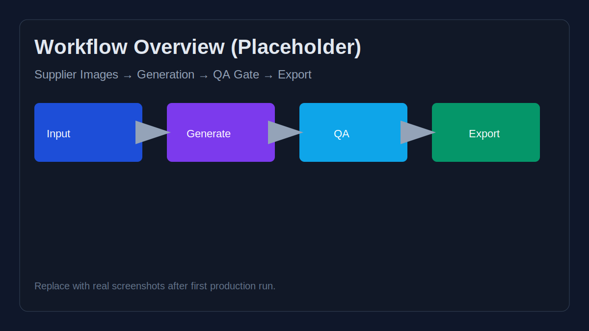
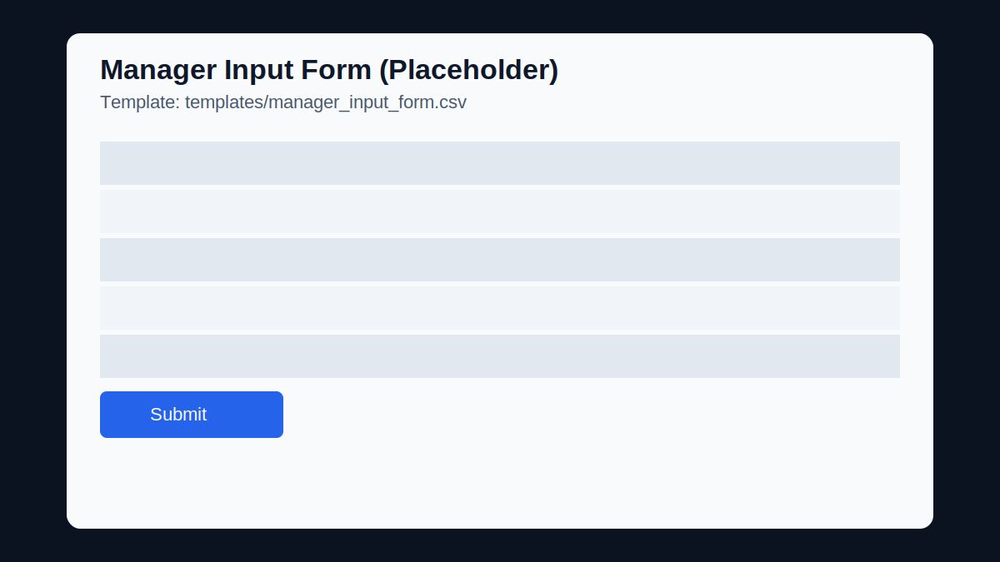

# E-commerce Product Image Workflow (Phase 1: Image Assets)

[](https://tytsxai.github.io/ecommerce-product-image-workflow/)
[](https://github.com/tytsxai/ecommerce-product-image-workflow/releases)
[](LICENSE)
[](https://github.com/tytsxai/ecommerce-product-image-workflow/commits/main)

[中文说明](README.zh-CN.md) · [Docs Site](https://tytsxai.github.io/ecommerce-product-image-workflow/) · [Quick Start](docs/en/quickstart.md)

A practical, **non-technical-friendly workflow** for transforming supplier product images into publish-ready e-commerce assets while enforcing:

- **Product consistency** (same product identity)
- **Visual differentiation** (new background/composition)
- **Text control** (English-only output text)
- **Reviewability** (clear QA and rejection reasons)

## Screenshots

### Workflow Overview



### Manager Input Template



### QA Checklist Template


> These are placeholders. Replace with real screenshots from your production pipeline.

## Why this project

Many stores rely on supplier images that are visually repetitive and hard to brand. This workflow gives teams a reproducible way to generate:

1. Showcase images (hero/lifestyle)
2. Spec images (dimensions/spec text)
3. How-to images (instructional visual cards)

without drifting from the actual product.

## Who this is for

- E-commerce managers
- Content operation teams
- Creative production vendors
- Automation builders integrating AI image pipelines

## Repository structure

```text
.
├── docs/
│   ├── en/
│   ├── zh-CN/
│   └── assets/
├── templates/
├── prompts/
├── examples/
└── .github/
```

## Quick start

1. Read `docs/en/quickstart.md`
2. Fill `templates/manager_input_form.csv`
3. Select or edit a style pack in `templates/style_packs.example.json`
4. Use prompt templates under `prompts/`
5. Validate output with `templates/qa_checklist.csv`
6. Log each batch in `templates/batch_record.csv`

## Documentation site (GitHub Pages)

- Site URL: `https://tytsxai.github.io/ecommerce-product-image-workflow/`
- Publishing source: GitHub Pages from `main` branch `docs/` folder
- Optional local docs build: `mkdocs build` with `mkdocs.yml`

## Core principles

- **Same product, different scene**: the product must remain accurate, but background/composition should change.
- **Deterministic text handling**: spec/how-to text should be template-rendered when possible.
- **Fail fast QA**: one-vote rejection criteria are explicit and auditable.
- **Compliance first**: only use commercially licensed fonts/assets.

## Limitations

- This repo provides workflow specifications and operational templates, not model weights.
- Not legal advice. You must review platform policies and local regulations.

## Roadmap

- [ ] Add visual QA reference examples (pass/fail image pairs)
- [ ] Add multilingual manager forms (EN/RU/ES)
- [ ] Publish automation adapters (n8n / Make / Zapier)
- [ ] Add CI checks for template schema consistency

## License

MIT (see `LICENSE`).
