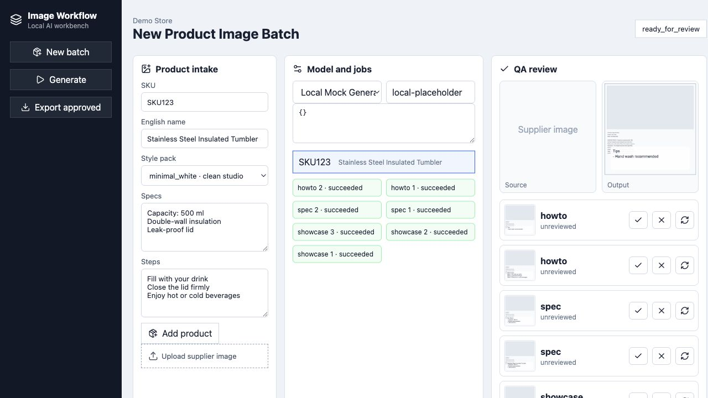

# E-commerce Product Image Workflow / 电商商品图 AI 工作流

[](https://tytsxai.github.io/ecommerce-product-image-workflow/)
[](https://github.com/tytsxai/ecommerce-product-image-workflow/releases)
[](LICENSE)
[](https://github.com/tytsxai/ecommerce-product-image-workflow/commits/main)

[中文说明](README.zh-CN.md) · [Docs Site](https://tytsxai.github.io/ecommerce-product-image-workflow/) · [Quick Start](docs/en/quickstart.md) · [Web Workbench](docs/en/web-workbench.md) · [MVP CLI](docs/en/mvp-cli.md) · [FAQ](docs/en/faq.md) · [llms.txt](llms.txt) · [Issues](https://github.com/tytsxai/ecommerce-product-image-workflow/issues)

> **中文定位**：这是一个开源的电商商品图 AI 生产工作流，用 CSV 表单、风格包、提示词模板、QA 清单、Python CLI 和本地 Web 工作台，把供应商图整理成可复核、可交付、可批量执行的商品图片生产流程。
>
> **English positioning**: An open-source e-commerce product image workflow for turning supplier product photos into structured, QA-ready image-production packages and local workbench runs. It is model-agnostic and can connect to a local mock generator or compatible HTTP image-generation APIs.

## What This Project Is / 项目是什么

`ecommerce-product-image-workflow` is a **workflow specification plus local tooling** for AI-assisted e-commerce product image production.

它解决的不是“单次生成一张好看的图”，而是更实际的生产问题：

- 供应商图风格混乱、重复度高，不适合直接上架。
- 多个 SKU、多个运营、多个模型之间难以保持一致。
- 商品主体容易被 AI 改形、改色、改比例。
- 规格图和说明图里的文字容易出错，缺少可审计的质检记录。

This repository provides templates, prompts, a Python MVP CLI, and a local FastAPI + React workbench so teams can prepare, generate, review, retry, and export product image assets in a repeatable way.

## Who It Is For / 适合谁

- 电商运营、内容运营、跨境电商团队，需要批量改造供应商图。
- 创意生产团队或外包供应商，需要标准化交付商品主图、规格图、说明图。
- 自动化工程师，需要把 AI image generation 接入 n8n、Make、Zapier、ComfyUI 或内部系统。
- 开发者需要一个轻量的 reference implementation，而不是从零设计商品图生产流程。

## Core Capabilities / 核心功能

- **Manager intake CSV**: product ID, English product name, dimensions, specs, how-to steps, style pack, source image paths.
- **Style packs**: reusable visual presets for background, mood, palette, lighting, and negative constraints.
- **Prompt package generation**: per-product prompts for showcase, spec, and how-to images.
- **Deterministic text sources**: English text files for spec/how-to overlays, reducing model-generated text errors.
- **QA gate**: fail-fast rules and rejection tags for product drift, duplicate-looking backgrounds, non-English text, wrong specs, and how-to meaning drift.
- **Batch traceability**: `batch_manifest.json`, per-product `manifest.json`, `qa_review.csv`, source-image references, and optional source-image hashes.
- **Local web workbench**: FastAPI + SQLite backend and React/Vite UI for batches, products, uploads, provider selection, async jobs, visual review, retry, and ZIP export.
- **Provider abstraction**: built-in `local_mock`, `generic_http`, and provider templates for OpenAI Images, Replicate, and ComfyUI-style integrations.

## Tech Stack / 技术栈

- **Python 3.9+** for the MVP CLI, package generation, validation, FastAPI backend, SQLite state, and Pillow text rendering.
- **FastAPI** for the local workbench API.
- **React + Vite + TypeScript** for the local operator UI.
- **CSV / JSON / Markdown** for manager inputs, style packs, batch manifests, QA review files, and operator runbooks.
- **Pytest** for CLI and workbench regression tests.

## Quick Start / 快速开始

### Option A: CLI package generation / 命令行生成生产包

Run from the repository root:

```bash
python3 -m pip install -e .

python3 -m mvp_image_workflow inspect \
  --input examples/products_minimum.csv

python3 -m mvp_image_workflow generate \
  --input examples/products_minimum.csv \
  --out out_mvp \
  --batch-id 2026-05A

python3 -m mvp_image_workflow validate --out out_mvp
```

The generated `out_mvp/` folder contains:

- `batch_manifest.json`
- `qa_review.csv`
- `operator_runbook.md`
- one folder per product, with prompts, text sources, expected output folders, source references, and `manifest.json`

If your CSV has `source_image_paths` or `supplier_image_paths`, add `--copy-source-images` to copy local source images into each product package and record hashes.

### Option B: Local Web Workbench / 本地浏览器工作台

Use this path when non-technical operators need a UI for intake, generation, review, retry, and export:

```bash
python3 -m pip install -e ".[web]"
cd frontend
npm install
npm run build
cd ..
python3 -m ecommerce_product_image_workflow.web
```

Default URL:

```text
http://127.0.0.1:8787
```

Use `EPI_WORKFLOW_HOME=/path/to/local/state` if you want to choose where SQLite data, uploads, generated assets, and exports are stored.

## Use Cases / 使用场景

- Supplier image to branded e-commerce hero image / 供应商图改造为品牌化商品主图
- AI product photography workflow for Shopify, Amazon, Shopee, Etsy, Temu, independent stores, or internal catalogs
- Batch product image prompt generation with CSV inputs
- Spec image and how-to image production with controlled English text overlays
- QA checklist for AI-generated e-commerce product images
- Local proof-of-concept before wiring n8n, Make, Zapier, ComfyUI, or internal automation

## Repository Structure / 仓库结构

```text
.
├── README.md / README.zh-CN.md
├── docs/
│   ├── en/
│   ├── zh-CN/
│   └── assets/
├── ecommerce_product_image_workflow/   # FastAPI workbench backend + providers
├── frontend/                           # React/Vite workbench UI
├── mvp_image_workflow/                 # Python MVP CLI
├── templates/                          # CSV/JSON templates
├── prompts/                            # reusable manager prompt templates
├── examples/                           # runnable sample CSV/JSON inputs
└── tests/
```

## Screenshots / 截图

The local workbench screenshot below is generated from the demo UI. The SVG previews document the underlying workflow templates.

### Local Web Workbench



### Workflow Overview


### Manager Input Template


### QA Checklist Template


## What It Does Not Do / 限制与注意事项

- It does **not** ship model weights or a hosted image-generation service.
- The MVP CLI does **not** call image models; it prepares prompts, text files, manifests, and QA artifacts.
- The web workbench can generate through `local_mock` or `generic_http`; hosted provider entries such as `openai_images`, `replicate`, and `comfyui_http` are templates or integration starting points unless you extend/configure them for production calls.
- It is image-only for Phase 1. Video, 3D, AR, and marketplace publishing automation are outside the current scope.
- It is not legal advice. You still need to verify platform policies, AI model terms, font licenses, asset licenses, and local regulations.
- Product identity still needs human review. The workflow makes QA explicit; it cannot guarantee that an AI model preserves product shape, color, material, or proportions.

## Documentation / 文档入口

- [Quick Start](docs/en/quickstart.md)
- [Web Workbench](docs/en/web-workbench.md)
- [MVP CLI](docs/en/mvp-cli.md)
- [End-to-End Workflow](docs/en/workflow.md)
- [Quality Gate](docs/en/quality-gate.md)
- [Risk & Compliance](docs/en/compliance.md)
- [FAQ](docs/en/faq.md)
- [中文文档导航](docs/zh-CN/README.md)
- [llms.txt](llms.txt) for AI search engines, agents, and LLM readers

## FAQ

**Which image model should I use?**
The workflow is model-agnostic. You can use Midjourney, Flux, SDXL, Imagen, DALL-E, ComfyUI, or any internal model/API if its license and output quality fit your use case.

**Can non-technical teams use it?**
Yes. The intended operating model is: managers fill CSV inputs, operators run the CLI or web workbench, reviewers use the QA checklist, and engineers automate only the parts that are worth automating.

**How is this different from Canva templates or Photoshop actions?**
Canva and Photoshop are production tools. This project defines the repeatable workflow: what inputs are required, what prompts and files are generated, how outputs are named, and how QA decisions are recorded.

**Can I connect it to n8n / Make / Zapier?**
Yes. The CSV inputs, JSON style packs, generated manifests, and HTTP provider boundary are designed to be automation-friendly. Turnkey adapters are roadmap items, not fully shipped in this repo yet.

**Is the output commercially usable?**
That depends on your model, source images, fonts, assets, platform rules, and jurisdiction. This project gives you a QA and audit structure, but you must verify commercial-use rights yourself.

## Search Keywords / 搜索关键词

Natural search phrases this project is designed to answer:

`e-commerce product image workflow`, `AI product photography pipeline`, `supplier image to hero image`, `AI e-commerce image generation`, `product image QA checklist`, `brand-consistent product images`, `电商商品图 AI 工作流`, `供应商图改造电商主图`, `商品图提示词模板`, `电商主图批量生成`, `规格图说明图生成`, `AI 商品图质检清单`.

## Suggested GitHub Topics

`ecommerce`, `product-images`, `ai-image-generation`, `product-photography`, `prompt-engineering`, `workflow-automation`, `fastapi`, `react`, `vite`, `quality-assurance`, `computer-vision-workflow`, `ecommerce-automation`

## Roadmap

- [x] Python MVP CLI for package generation and validation
- [x] Local web workbench with provider abstraction, QA review, retry, and export
- [x] Style pack and package consistency checks
- [ ] Real visual QA reference examples with pass/fail image pairs
- [ ] Production-ready first-class provider adapters
- [ ] Automation adapters for n8n / Make / Zapier
- [ ] Multilingual manager forms beyond the current examples

## License

MIT (see [LICENSE](LICENSE)).

## Star History

[](https://www.star-history.com/#tytsxai/ecommerce-product-image-workflow&Date)
