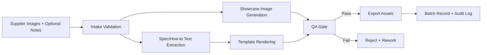

# End-to-End Workflow

## Design choices

- Product region protection (mask/reference lock)
- Template-based text rendering for deterministic spec/how-to cards
- Style packs to reduce prompt variance

## Recommended roles

- Manager: intake + final pass/reject
- Ops/Brand: style and policy ownership
- Implementation: pipeline and QA automation
