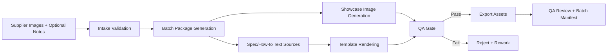

# End-to-End Workflow

```mermaid
flowchart LR
    A[Supplier Images + Optional Notes] --> B[Intake Validation]
    B --> C[Batch Package Generation]
    C --> D[Showcase Image Generation]
    C --> E[Spec/How-to Text Sources]
    E --> F[Template Rendering]
    D --> G[QA Gate]
    F --> G
    G -->|Pass| H[Export Assets]
    G -->|Fail| I[Reject + Rework]
    H --> J[QA Review + Batch Manifest]
```

## Design choices

- Product region protection (mask/reference lock)
- Template-based text rendering for deterministic spec/how-to cards
- Style packs to reduce prompt variance
- Batch-level manifest and QA review CSV for handoff traceability
- Optional supplier image copy + SHA-256 recording for local source audit
- Local web workbench for intake, provider selection, async generation, QA, retry, and export
- Provider abstraction so teams can use OpenAI, Replicate, ComfyUI, or any compatible HTTP image API

## Recommended roles

- Manager: intake + final pass/reject
- Ops/Brand: style and policy ownership
- Implementation: pipeline and QA automation
